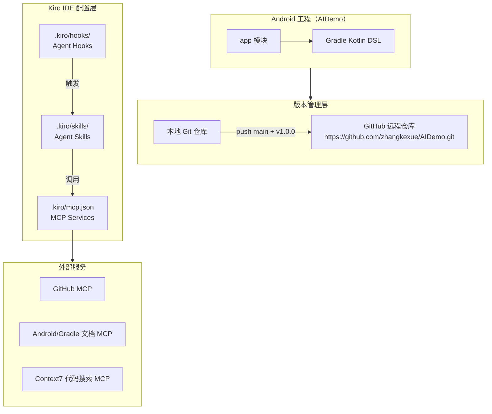

# 技术设计文档：android-aidemo-setup

## 概述

本文档描述 AIDemo Android 工程的搭建方案，涵盖工程创建、Git 版本管理、Kiro IDE 自动化配置（Agent Hooks / Agent Skills）以及 MCP Services 集成的完整技术设计。

目标是建立一套可重复、可维护的 Android 开发基础环境，使 AI Agent 能够在开发流程的关键节点自动执行代码质量保障任务。

---

## 架构

### 整体架构图



### 关键设计决策

| 决策 | 选择 | 理由 |
|------|------|------|
| 构建脚本语言 | Kotlin DSL (.kts) | 类型安全、IDE 补全支持更好，与主语言统一 |
| 代码格式化 | ktlint | Kotlin 官方推荐，零配置即可使用 |
| 静态分析 | detekt + Android Lint | detekt 覆盖通用 Kotlin 质量，Lint 覆盖 Android 特定问题 |
| MCP 认证 | 环境变量 GITHUB_TOKEN | 避免凭证硬编码，符合安全最佳实践 |

---

## 组件与接口

### 1. Android 工程结构

```
AIDemo/
├── app/
│   ├── src/
│   │   ├── main/
│   │   │   ├── java/com/zkx/aidemo/
│   │   │   │   └── MainActivity.kt
│   │   │   ├── res/
│   │   │   │   ├── layout/activity_main.xml
│   │   │   │   ├── values/strings.xml
│   │   │   │   └── values/themes.xml
│   │   │   └── AndroidManifest.xml
│   │   └── test/
│   ├── build.gradle.kts
│   └── proguard-rules.pro
├── gradle/
│   └── wrapper/
│       ├── gradle-wrapper.jar
│       └── gradle-wrapper.properties
├── .kiro/
│   ├── hooks/
│   │   ├── on-save.yaml
│   │   ├── post-generate.yaml
│   │   ├── pre-commit.yaml
│   │   └── pre-push.yaml
│   ├── skills/
│   │   ├── ktlint-format.md
│   │   ├── static-analysis.md
│   │   ├── code-review.md
│   │   └── pr-push.md
│   └── mcp.json
├── .gitignore
├── build.gradle.kts
├── settings.gradle.kts
└── gradle.properties
```

### 2. Kiro Hooks 组件

| Hook 名称 | 触发时机 | 执行动作 |
|-----------|----------|----------|
| on-save | 文件保存后（fileEdited） | 调用 ktlint-format Skill |
| post-generate | AI 代码生成后（postToolUse） | 调用 static-analysis Skill |
| pre-commit | git commit 前（userTriggered） | 调用 code-review + ktlint-format Skill |
| pre-push | git push 前（userTriggered） | 调用完整质量检查流程 |

### 3. Kiro Skills 组件

| Skill 名称 | 工具依赖 | 输出 |
|------------|----------|------|
| ktlint-format | ktlint CLI | 格式化后的 .kt 文件 |
| static-analysis | detekt CLI + Android Lint | 问题报告（数量/级别/位置） |
| code-review | AI Agent + diff | Markdown 格式审查报告 |
| pr-push | GitHub MCP | PR URL |

### 4. MCP Services 组件

| 服务名称 | 协议/工具 | 主要能力 |
|----------|-----------|----------|
| github | @modelcontextprotocol/server-github | PR 创建、Issue 管理、仓库查询 |
| android-docs | context7 / 自定义 | Android API 文档查询 |
| context7 | @upstash/context7-mcp | 代码语义搜索与分析 |

---

## 数据模型

### Gradle 配置模型

```kotlin
// app/build.gradle.kts 核心配置
android {
    namespace = "com.zkx.aidemo"
    compileSdk = 35

    defaultConfig {
        applicationId = "com.zkx.aidemo"
        minSdk = 21
        targetSdk = 35
        versionCode = 1
        versionName = "1.0.0"
    }
}
```

### Hook 配置模型（YAML Schema）

```yaml
# .kiro/hooks/<hook-name>.yaml
name: string          # Hook 唯一标识
trigger:
  type: string        # fileEdited | postToolUse | userTriggered
  filter?: string     # 文件过滤模式（可选）
action:
  skill: string       # 调用的 Skill 名称
  args?: object       # 传递给 Skill 的参数（可选）
onError:
  message: string     # 失败时输出的错误信息
  block: boolean      # 是否阻止后续操作
```

### MCP 配置模型（JSON Schema）

```json
{
  "mcpServers": {
    "<service-name>": {
      "command": "string",
      "args": ["string"],
      "env": {
        "<KEY>": "string"
      }
    }
  }
}
```

---

## 关键配置文件详细内容

### settings.gradle.kts

```kotlin
pluginManagement {
    repositories {
        google()
        mavenCentral()
        gradlePluginPortal()
    }
}
dependencyResolutionManagement {
    repositoriesMode.set(RepositoriesMode.FAIL_ON_PROJECT_REPOS)
    repositories {
        google()
        mavenCentral()
    }
}

rootProject.name = "AIDemo"
include(":app")
```

### 根目录 build.gradle.kts

```kotlin
plugins {
    alias(libs.plugins.android.application) apply false
    alias(libs.plugins.kotlin.android) apply false
    // detekt 静态分析
    id("io.gitlab.arturbosch.detekt") version "1.23.6" apply false
}
```

### app/build.gradle.kts

```kotlin
plugins {
    alias(libs.plugins.android.application)
    alias(libs.plugins.kotlin.android)
    id("io.gitlab.arturbosch.detekt")
}

android {
    namespace = "com.zkx.aidemo"
    compileSdk = 35

    defaultConfig {
        applicationId = "com.zkx.aidemo"
        minSdk = 21
        targetSdk = 35
        versionCode = 1
        versionName = "1.0.0"
        testInstrumentationRunner = "androidx.test.runner.AndroidJUnitRunner"
    }

    buildTypes {
        release {
            isMinifyEnabled = false
            proguardFiles(
                getDefaultProguardFile("proguard-android-optimize.txt"),
                "proguard-rules.pro"
            )
        }
    }

    compileOptions {
        sourceCompatibility = JavaVersion.VERSION_11
        targetCompatibility = JavaVersion.VERSION_11
    }

    kotlinOptions {
        jvmTarget = "11"
    }
}

// ktlint 配置（通过 Gradle 任务调用 CLI）
tasks.register<Exec>("ktlintCheck") {
    commandLine("ktlint", "src/**/*.kt")
}

tasks.register<Exec>("ktlintFormat") {
    commandLine("ktlint", "--format", "src/**/*.kt")
}

// detekt 配置
detekt {
    config.setFrom(files("$rootDir/detekt.yml"))
    buildUponDefaultConfig = true
}

dependencies {
    implementation(libs.androidx.core.ktx)
    implementation(libs.androidx.appcompat)
    implementation(libs.material)
    testImplementation(libs.junit)
    androidTestImplementation(libs.androidx.junit)
    androidTestImplementation(libs.androidx.espresso.core)
}
```

### .gitignore

```gitignore
# Android 构建产物
*.iml
.gradle/
/local.properties
/.idea/
.DS_Store
/build/
/captures/
.externalNativeBuild/
.cxx/
*.apk
*.aab
*.ap_

# 模块构建产物
app/build/

# Gradle wrapper（保留 jar 和 properties）
!gradle/wrapper/gradle-wrapper.jar
!gradle/wrapper/gradle-wrapper.properties

# Kiro 本地缓存（保留配置文件）
.kiro/cache/
```

### .kiro/hooks/on-save.yaml

```yaml
name: on-save
description: 文件保存时自动触发 ktlint 格式检查
trigger:
  type: fileEdited
  filter: "**/*.kt"
action:
  skill: ktlint-format
  args:
    mode: check
onError:
  message: "ktlint 格式检查失败，请运行 ./gradlew ktlintFormat 修复格式问题"
  block: false
```

### .kiro/hooks/post-generate.yaml

```yaml
name: post-generate
description: AI 代码生成后自动触发静态检测
trigger:
  type: postToolUse
  filter: "**/*.kt"
action:
  skill: static-analysis
onError:
  message: "静态检测发现问题，请查看检测报告并修复后继续"
  block: false
```

### .kiro/hooks/pre-commit.yaml

```yaml
name: pre-commit
description: git commit 前触发 Code Review 和格式检查
trigger:
  type: userTriggered
  event: pre-commit
action:
  skill: code-review
  args:
    includeFormat: true
onError:
  message: "Pre-commit 检查失败，提交已阻止。请修复问题后重新提交"
  block: true
```

### .kiro/hooks/pre-push.yaml

```yaml
name: pre-push
description: git push 前触发完整质量检查流程
trigger:
  type: userTriggered
  event: pre-push
action:
  skill: static-analysis
  args:
    full: true
onError:
  message: "Pre-push 质量检查失败，推送已阻止。请查看报告并修复所有问题"
  block: true
```

### .kiro/skills/ktlint-format.md

```markdown
---
name: ktlint-format
description: 使用 ktlint 对 Kotlin 源文件执行格式化或格式检查
---

## 执行步骤

1. 确认 ktlint 已安装（`ktlint --version`）
2. 根据 mode 参数决定执行模式：
   - `check`：执行 `./gradlew ktlintCheck`，仅检查不修改
   - `format`：执行 `./gradlew ktlintFormat`，自动修复格式问题
3. 输出格式化结果，包含修改的文件列表

## 输出格式

- 成功：`✅ ktlint: 所有文件格式正确`
- 失败：`❌ ktlint: 发现 N 处格式问题，文件：<路径列表>`
```

### .kiro/skills/static-analysis.md

```markdown
---
name: static-analysis
description: 集成 detekt 和 Android Lint 对代码进行质量分析
---

## 执行步骤

1. 执行 detekt：`./gradlew detekt`
2. 执行 Android Lint：`./gradlew lint`
3. 汇总两个工具的报告，生成统一输出

## 输出格式

报告必须包含以下字段：
- 问题总数
- 按严重级别分类（error / warning / info）
- 每个问题的文件路径和行号

示例：
```
静态检测报告：
  detekt: 3 个问题（1 error, 2 warning）
    - [error] app/src/main/.../MainActivity.kt:42 - ComplexMethod
    - [warning] app/src/main/.../MainActivity.kt:15 - MagicNumber
  Android Lint: 1 个问题（0 error, 1 warning）
    - [warning] app/src/main/res/layout/activity_main.xml:8 - HardcodedText
```
```

### .kiro/skills/code-review.md

```markdown
---
name: code-review
description: 对变更文件进行 AI 辅助代码审查并输出审查报告
---

## 执行步骤

1. 获取当前 git diff（`git diff --staged`）
2. 对每个变更文件进行 AI 代码审查，关注：
   - 代码逻辑正确性
   - Kotlin 最佳实践
   - Android 性能问题
   - 安全隐患
3. 如 includeFormat=true，同时执行 ktlint-format（check 模式）
4. 输出 Markdown 格式审查报告

## 输出格式

Markdown 报告，包含：审查摘要、问题列表（按文件）、建议改进项
```

### .kiro/skills/pr-push.md

```markdown
---
name: pr-push
description: 创建 Pull Request 并推送至 GitHub 远程仓库
---

## 执行步骤

1. 确认当前分支不是 main
2. 执行 `git push origin <current-branch>`
3. 通过 GitHub MCP 创建 Pull Request：
   - base: main
   - head: 当前分支
   - title: 从最近 commit message 生成
   - body: 包含变更摘要和 Code Review 报告链接
4. 输出 PR URL

## 依赖

- GitHub MCP 服务（需要 GITHUB_TOKEN 环境变量）
```

### .kiro/mcp.json

```json
{
  "mcpServers": {
    "github": {
      "command": "npx",
      "args": ["-y", "@modelcontextprotocol/server-github"],
      "env": {
        "GITHUB_PERSONAL_ACCESS_TOKEN": "${GITHUB_TOKEN}"
      }
    },
    "context7": {
      "command": "npx",
      "args": ["-y", "@upstash/context7-mcp@latest"]
    },
    "android-docs": {
      "command": "npx",
      "args": ["-y", "@modelcontextprotocol/server-fetch"],
      "env": {
        "ALLOWED_DOMAINS": "developer.android.com,docs.gradle.org,kotlinlang.org"
      }
    }
  }
}
```

---

## 正确性属性

*属性（Property）是在系统所有有效执行中都应成立的特征或行为——本质上是对系统应该做什么的形式化陈述。属性是连接人类可读规范与机器可验证正确性保证的桥梁。*

### 属性 1：.gitignore 覆盖所有 Android 构建产物

*对于任意* Android 标准构建产物路径（`build/`、`.gradle/`、`*.apk`、`*.aab`、`app/build/` 等），`.gitignore` 规则都应该匹配并忽略该路径，使其不被 git 追踪。

**验证需求：2.2**

### 属性 2：静态检测报告包含必要字段

*对于任意* 代码输入，static-analysis Skill 执行完成后输出的报告都必须包含：问题总数、每个问题的严重级别（error/warning/info）以及文件路径和行号。

**验证需求：4.6**

### 属性 3：MCP 配置不包含硬编码凭证

*对于任意* MCP 服务配置，凭证相关字段（token、key、secret 等）都不应包含硬编码的字面量值，而应引用环境变量（格式为 `${ENV_VAR_NAME}`）。

**验证需求：5.6**

---

## 错误处理

### Git 推送失败

- 场景：网络不通、权限不足、远程仓库不存在
- 处理：捕获 git 命令退出码，解析 stderr 输出，以中文输出包含失败原因的错误信息
- 示例：`❌ 推送失败：远程仓库拒绝连接，请检查 GITHUB_TOKEN 权限或网络连接`

### Hook 执行失败

- 场景：依赖工具未安装（ktlint/detekt）、代码检查不通过
- 处理：根据 `block` 字段决定是否阻止后续操作，始终输出 `onError.message` 中定义的错误信息
- pre-commit / pre-push Hook 的 `block: true` 确保质量问题不会被跳过

### MCP 服务连接失败

- 场景：网络问题、服务不可用、token 过期
- 处理：单个 MCP 服务失败不影响其他服务，输出格式：`⚠️ MCP 服务 [<service-name>] 连接失败：<原因>`
- 其他服务继续正常运行，降级处理

### Gradle 构建失败

- 场景：依赖下载失败、编译错误
- 处理：输出 Gradle 标准错误信息，提示运行 `./gradlew --stacktrace` 获取详细日志

---

## 测试策略

### 双轨测试方法

本功能同时采用**示例测试**和**属性测试**两种方式，互为补充。

#### 示例测试（Example-Based Tests）

针对具体配置和集成点的验证：

| 测试用例 | 验证内容 | 对应需求 |
|----------|----------|----------|
| 工程结构验证 | 检查 app 模块目录结构、AndroidManifest.xml 存在性 | 1.4 |
| SDK 版本验证 | 解析 build.gradle.kts，验证 minSdk=21/targetSdk=35/compileSdk=35 | 1.2 |
| Kotlin DSL 验证 | 检查 .kts 文件存在，不存在 .groovy 文件 | 1.3 |
| 包名验证 | 检查 applicationId = "com.zkx.aidemo" | 1.1 |
| Git 远程仓库验证 | 执行 git remote -v，验证 URL 正确 | 2.1 |
| 标签验证 | 执行 git tag -l，验证 v1.0.0 存在 | 2.4 |
| Hook 配置完整性 | 验证 4 个 Hook YAML 文件存在且 YAML 语法有效 | 3.1-3.5 |
| Skills 配置完整性 | 验证 4 个 Skill 文件存在 | 4.1-4.5 |
| MCP 配置完整性 | 验证 mcp.json 存在且包含 3 个服务配置 | 5.1-5.4 |
| 构建成功验证 | 执行 ./gradlew assembleDebug，验证退出码为 0 | 1.5 |

边缘情况测试：

| 测试用例 | 验证内容 | 对应需求 |
|----------|----------|----------|
| 推送失败错误信息 | 模拟推送失败，验证错误输出可读 | 2.5 |
| Hook 失败阻断 | 模拟 Hook 失败，验证 block=true 时后续操作被阻止 | 3.6 |
| MCP 服务隔离 | 模拟单个 MCP 服务失败，验证其他服务不受影响 | 5.5 |

#### 属性测试（Property-Based Tests）

使用 JUnit 5 + [Kotest Property Testing](https://kotest.io/docs/proptest/property-based-testing.html) 实现，每个属性测试最少运行 100 次迭代。

**属性 1：.gitignore 覆盖所有 Android 构建产物**

```kotlin
// Feature: android-aidemo-setup, Property 1: .gitignore 覆盖所有 Android 构建产物
class GitignorePropertyTest : StringSpec({
    "对于任意 Android 构建产物路径，.gitignore 规则都应该匹配并忽略" {
        val buildArtifacts = listOf(
            "build/", "app/build/", ".gradle/",
            "app/release/app-release.apk", "app/release/app-release.aab"
        )
        // 使用 git check-ignore 验证每个路径都被忽略
        buildArtifacts.forAll { path ->
            val result = ProcessBuilder("git", "check-ignore", "-q", path).start()
            result.waitFor() shouldBe 0
        }
    }
})
```

**属性 2：静态检测报告包含必要字段**

```kotlin
// Feature: android-aidemo-setup, Property 2: 静态检测报告包含必要字段
class StaticAnalysisReportPropertyTest : StringSpec({
    "对于任意代码输入，静态检测报告都必须包含问题数量、严重级别和文件位置" {
        checkAll(100, Arb.string()) { codeContent ->
            val report = runStaticAnalysis(codeContent)
            report.totalIssues shouldBeGreaterThanOrEqualTo 0
            report.issues.forAll { issue ->
                issue.severity shouldBeIn listOf("error", "warning", "info")
                issue.filePath.shouldNotBeEmpty()
                issue.lineNumber shouldBeGreaterThan 0
            }
        }
    }
})
```

**属性 3：MCP 配置不包含硬编码凭证**

```kotlin
// Feature: android-aidemo-setup, Property 3: MCP 配置不包含硬编码凭证
class McpConfigSecurityPropertyTest : StringSpec({
    "对于任意 MCP 服务配置，凭证字段都不应包含硬编码字面量" {
        val mcpConfig = File(".kiro/mcp.json").readText()
        val json = Json.parseToJsonElement(mcpConfig)
        // 递归检查所有 env 字段，确保值格式为 ${ENV_VAR}
        val credentialKeys = listOf("token", "key", "secret", "password", "PERSONAL_ACCESS_TOKEN")
        credentialKeys.forAll { key ->
            findJsonValue(json, key)?.let { value ->
                value shouldMatch Regex("\\$\\{[A-Z_]+\\}")
            }
        }
    }
})
```

### 测试工具配置

- 属性测试库：[Kotest](https://kotest.io/) 5.x（`io.kotest:kotest-property`）
- 单元测试框架：JUnit 5
- 最小迭代次数：每个属性测试 100 次
- 集成测试：通过 GitHub Actions CI 在真实 Android 环境中执行 `./gradlew assembleDebug`
