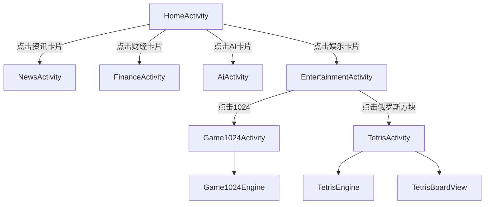

# 技术设计文档：首页卡片与游戏（home-cards-and-games）

## 概述

本设计文档描述 AIDemo 应用 1.0.1 版本的技术实现方案。核心功能包括：

- 首页（HomeActivity）展示 2×2 圆角卡片网格，点击卡片触发翻转动画并跳转二级页面
- 资讯、财经、AI 三个占位页面
- 娱乐页面（Jetpack Compose 实现）包含游戏入口列表
- 1024 数字合并游戏（完整可玩）
- 俄罗斯方块游戏（完整可玩，自定义 View 渲染）

技术约束：Kotlin 2.0.0，minSdk 21，targetSdk 35，Jetpack Compose 用于娱乐页面，其余页面使用传统 View 体系。

---

## 架构

整体采用单模块、多 Activity 架构，无额外框架层。游戏逻辑与 UI 分离：Engine 类为纯 Kotlin（无 Android 依赖），Activity/View 负责渲染和用户输入。



### 依赖新增

需在 `gradle/libs.versions.toml` 和 `app/build.gradle.kts` 中新增 Jetpack Compose 相关依赖：

| 依赖 | 版本 |
|------|------|
| compose-bom | 2024.05.00 |
| compose-ui | BOM 管理 |
| compose-material3 | BOM 管理 |
| compose-activity | 1.9.0 |
| kotlin-compose-compiler | Kotlin 2.0.0 对应插件 |

---

## 组件与接口

### 1. HomeActivity（改造 MainActivity）

将 `MainActivity` 重命名为 `HomeActivity`，布局改为 2×2 卡片网格。

**布局文件：** `res/layout/activity_home.xml`

```
ConstraintLayout (根布局)
  └── GridLayout (2列, wrap_content行高)
        ├── MaterialCardView (资讯)
        ├── MaterialCardView (财经)
        ├── MaterialCardView (AI)
        └── MaterialCardView (娱乐)
```

卡片属性：
- `app:cardCornerRadius="12dp"`
- `app:cardElevation="4dp"`
- 宽度：`0dp`（match constraint），margin 8dp
- 内含 `TextView` 居中显示标题

响应式布局：通过 `res/layout-sw360dp/activity_home.xml` 提供宽屏 2 列布局，默认布局（`res/layout/activity_home.xml`）使用单列（`GridLayout columnCount=1`）以兼容窄屏，`res/layout-w360dp/activity_home.xml` 使用 2 列。

> 注：使用 `layout-w360dp` 限定符（可用宽度 ≥ 360dp 时使用 2 列，否则单列）。

### 2. FlipAnimator

```kotlin
object FlipAnimator {
    fun flip(view: View, onMidpoint: () -> Unit, onEnd: () -> Unit)
}
```

实现：
- 第一段：`ObjectAnimator.ofFloat(view, "rotationY", 0f, 90f)`，duration 150ms
- 第一段结束时调用 `onMidpoint()`（此时可切换卡片内容，若需要）
- 第二段：`ObjectAnimator.ofFloat(view, "rotationY", -90f, 0f)`，duration 150ms
- 第二段结束时调用 `onEnd()`（触发页面跳转）
- 动画期间通过 `isAnimating` 标志位防止重复点击

### 3. 占位页面（NewsActivity、FinanceActivity、AiActivity）

三个页面结构相同，布局文件分别为 `activity_news.xml`、`activity_finance.xml`、`activity_ai.xml`。

```
ConstraintLayout
  └── TextView (居中，显示页面标题)
```

均继承 `AppCompatActivity`，在 `onCreate` 中调用 `supportActionBar?.setDisplayHomeAsUpEnabled(true)` 提供返回导航。

### 4. EntertainmentActivity（Compose）

```kotlin
class EntertainmentActivity : ComponentActivity() {
    override fun onCreate(...) {
        setContent { EntertainmentScreen(onGame1024Click, onTetrisClick) }
    }
}
```

**Composable 结构：**

```
EntertainmentScreen
  └── Scaffold(topBar = "娱乐")
        └── LazyColumn
              ├── GameListItem("1024", onClick = navigateToGame1024)
              └── GameListItem("俄罗斯方块", onClick = navigateToTetris)
```

### 5. Game1024Engine

纯 Kotlin 类，无 Android 依赖，便于单元测试。

```kotlin
class Game1024Engine {
    val board: Array<IntArray>          // 4×4，0 表示空格
    var score: Int
    var isGameOver: Boolean
    var isWin: Boolean

    fun reset()
    fun move(direction: Direction): Boolean  // 返回是否发生有效移动
    fun isGameOver(): Boolean
    fun isWin(): Boolean

    enum class Direction { UP, DOWN, LEFT, RIGHT }
}
```

**移动算法（以 LEFT 为例）：**
1. 对每一行，过滤出非零元素，向左压缩
2. 从左到右扫描，相邻相同则合并（值翻倍，分数累加，跳过下一个）
3. 补零至长度 4
4. 若棋盘发生变化，在随机空格生成新方块（2: 90%，4: 10%）

**状态判断：**
- `isWin()`：棋盘中存在值 ≥ 1024 的方块
- `isGameOver()`：棋盘已满 AND 四个方向均无有效移动

### 6. Game1024Activity

```kotlin
class Game1024Activity : AppCompatActivity() {
    private val engine = Game1024Engine()
    private lateinit var boardView: Game1024BoardView  // 自定义 View 或 GridLayout
}
```

布局：`activity_game1024.xml`

```
ConstraintLayout
  ├── TextView (分数显示)
  ├── Game1024BoardView (4×4 棋盘，自定义 View)
  ├── Button (重新开始)
  └── GestureDetector (覆盖全棋盘，检测滑动方向)
```

`Game1024BoardView` 继承 `View`，在 `onDraw` 中绘制方块（不同数值对应不同背景色）。

### 7. TetrisEngine

纯 Kotlin 类，无 Android 依赖。

```kotlin
class TetrisEngine(
    val cols: Int = 10,
    val rows: Int = 20
) {
    val board: Array<IntArray>          // 0=空，非0=已固定方块颜色索引
    var currentPiece: TetrisPiece
    var nextPiece: TetrisPiece
    var score: Int
    var level: Int
    var isGameOver: Boolean
    var isPaused: Boolean

    fun start()
    fun reset()
    fun moveLeft(): Boolean
    fun moveRight(): Boolean
    fun rotate(): Boolean
    fun hardDrop()
    fun tick(): TickResult          // 每帧调用，处理自动下落
    fun pause()
    fun resume()

    enum class TickResult { MOVED, LOCKED, GAME_OVER }
}

data class TetrisPiece(
    val shape: PieceShape,
    var x: Int,
    var y: Int,
    var rotation: Int = 0
)

enum class PieceShape { I, O, T, S, Z, J, L }
```

**7 种方块形状定义：** 每种形状存储 4 个旋转状态的坐标偏移数组（相对于锚点）。

**消行逻辑：**
1. 检测所有已填满的行（每格非零）
2. 从下到上移除满行，上方行整体下移
3. 按消除行数计分：1行=100×level，2行=300×level，3行=500×level，4行=800×level
4. 检查是否达到升级阈值（每 1000 分升一级），升级后加快 `tick` 间隔

**下落速度：** `dropInterval = max(100, 1000 - level * 100)` ms

### 8. TetrisBoardView（自定义 View）

```kotlin
class TetrisBoardView(context: Context, attrs: AttributeSet?) : View(context, attrs) {
    var engine: TetrisEngine? = null

    override fun onDraw(canvas: Canvas) {
        // 1. 绘制背景网格
        // 2. 绘制已固定方块（engine.board）
        // 3. 绘制当前活动方块（engine.currentPiece）
    }
}
```

### 9. TetrisActivity

```kotlin
class TetrisActivity : AppCompatActivity() {
    private val engine = TetrisEngine()
    private lateinit var boardView: TetrisBoardView
    private lateinit var handler: Handler
}
```

布局：`activity_tetris.xml`

```
ConstraintLayout
  ├── TetrisBoardView (游戏区域)
  ├── TextView (分数)
  ├── TextView (等级)
  ├── NextPieceView (下一个方块预览)
  ├── Button (左移)
  ├── Button (右移)
  ├── Button (旋转)
  ├── Button (加速/硬降)
  └── Button (暂停/继续)
```

游戏循环通过 `Handler.postDelayed` 实现，每 `dropInterval` ms 调用 `engine.tick()`，根据返回值更新 UI 或显示游戏结束对话框。

---

## 数据模型

### Game1024Engine 内部状态

```kotlin
// 棋盘：4×4 Int 数组，0 表示空格，非零表示方块数值
val board: Array<IntArray> = Array(4) { IntArray(4) }
var score: Int = 0
```

### TetrisEngine 内部状态

```kotlin
// 游戏区域：rows×cols Int 数组，0=空，1-7=方块颜色索引
val board: Array<IntArray> = Array(rows) { IntArray(cols) }
var score: Int = 0
var level: Int = 1
var isGameOver: Boolean = false
var isPaused: Boolean = false
```

### 方块形状数据（TetrisPiece shapes）

每种形状定义 4 个旋转状态，每个状态为相对坐标列表：

```kotlin
// 示例：I 形方块
PieceShape.I -> arrayOf(
    arrayOf(intArrayOf(0,1), intArrayOf(1,1), intArrayOf(2,1), intArrayOf(3,1)), // 0°
    arrayOf(intArrayOf(2,0), intArrayOf(2,1), intArrayOf(2,2), intArrayOf(2,3)), // 90°
    // ...
)
```

### AndroidManifest.xml 注册

需注册以下 Activity：

```xml
<activity android:name=".HomeActivity" android:exported="true">
    <intent-filter>
        <action android:name="android.intent.action.MAIN" />
        <category android:name="android.intent.category.LAUNCHER" />
    </intent-filter>
</activity>
<activity android:name=".NewsActivity" />
<activity android:name=".FinanceActivity" />
<activity android:name=".AiActivity" />
<activity android:name=".EntertainmentActivity" />
<activity android:name=".Game1024Activity" />
<activity android:name=".TetrisActivity" />
```

---

## 正确性属性

*属性（Property）是在系统所有合法执行中都应成立的特征或行为——本质上是对系统应做什么的形式化陈述。属性是人类可读规范与机器可验证正确性保证之间的桥梁。*

### 属性 1：移动后无相邻相同数字

*对于任意* 合法的 4×4 棋盘状态，执行任意方向的移动后，沿该移动方向上不应存在相邻的相同非零数字（即所有可合并的方块已被合并）。

**验证需求：5.2**

### 属性 2：分数增量等于合并值之和

*对于任意* 合法的棋盘状态，执行一次移动后，分数的增量应等于本次移动中所有合并产生的新方块数值之和。

**验证需求：5.3**

### 属性 3：有效移动后方块数增加一

*对于任意* 合法的棋盘状态（存在空格），若执行移动后棋盘发生变化（有效移动），则棋盘中非零方块的数量应恰好增加 1。

**验证需求：5.4**

### 属性 4：棋盘数值总和单调不减（1024 游戏单调性）

*对于任意* 合法的棋盘状态，执行任意方向的移动后，棋盘中所有方块数值之和应大于或等于移动前的总和（合并只会使总和增加或不变，不会减少）。

**验证需求：5.9**

### 属性 5：游戏结束判定正确性

*对于任意* 棋盘已满且四个方向均无有效移动的状态，`isGameOver()` 应返回 `true`；反之，若存在空格或可合并方块，`isGameOver()` 应返回 `false`。

**验证需求：5.6**

### 属性 6：俄罗斯方块操作合法性

*对于任意* 合法的游戏状态，执行左移、右移或旋转操作后，当前方块的所有格子应仍在游戏区域边界内，且不与已固定方块重叠（若操作不合法则方块位置不变）。

**验证需求：6.4, 6.5, 6.6**

### 属性 7：消行后无完整行

*对于任意* 游戏状态，执行消行操作后，游戏区域中不应存在任何完全填满的行。

**验证需求：6.9**

### 属性 8：重力属性（消行后无悬空空行）

*对于任意* 合法的游戏状态，消除完整行后，游戏区域中不应存在"空行位于非空行之上"的情况——即所有非空行应连续地位于游戏区域底部，上方全为空行。

**验证需求：6.14**

---

## 错误处理

| 场景 | 处理方式 |
|------|----------|
| 翻转动画期间重复点击 | `FlipAnimator` 通过 `isAnimating` 标志位忽略重复点击 |
| 页面跳转失败（startActivity 抛出异常） | try-catch 捕获，恢复卡片至初始状态（rotationY = 0f） |
| 1024 游戏：无效移动（棋盘无变化） | `move()` 返回 `false`，不生成新方块，不更新分数 |
| 1024 游戏：棋盘已满时尝试生成新方块 | 检查空格列表为空时跳过生成，触发 `isGameOver()` 检查 |
| 俄罗斯方块：操作越界或重叠 | 操作方法返回 `false`，方块位置不变 |
| 俄罗斯方块：游戏结束后继续操作 | `isGameOver` 为 `true` 时所有操作方法直接返回 |
| 俄罗斯方块：暂停状态下的操作 | `isPaused` 为 `true` 时 `tick()` 不执行，操作方法仍可响应（可选：暂停时也禁止操作） |

---

## 测试策略

### 双轨测试方法

采用单元测试 + 属性测试的互补方案：
- **单元测试**：验证具体示例、边界条件和错误处理
- **属性测试**：通过随机输入验证普遍性属性，每个属性至少运行 100 次迭代

### 属性测试库

使用已有依赖 **Kotest 5.9.1**（`kotest-property` 模块），采用 `StringSpec` 风格编写属性测试。

### 单元测试（具体示例）

文件：`app/src/test/java/com/zkx/aidemo/Game1024EngineTest.kt`

- 初始化后棋盘恰好有 2 个非零方块，值为 2 或 4（对应需求 5.1）
- 重置后分数为 0，棋盘恰好有 2 个非零方块（对应需求 5.8）
- 特定棋盘状态下左移的预期结果（对应需求 5.2）

文件：`app/src/test/java/com/zkx/aidemo/TetrisEngineTest.kt`

- 7 种方块形状均可生成（对应需求 6.2）
- 等级提升阈值验证（对应需求 6.10）
- 暂停/继续状态切换（对应需求 6.12）
- 重置后状态归零（对应需求 6.13）

### 属性测试

文件：`app/src/test/java/com/zkx/aidemo/Game1024PropertyTest.kt`

```kotlin
// Feature: home-cards-and-games, Property 1: 移动后无相邻相同数字
// Feature: home-cards-and-games, Property 2: 分数增量等于合并值之和
// Feature: home-cards-and-games, Property 3: 有效移动后方块数增加一
// Feature: home-cards-and-games, Property 4: 棋盘数值总和单调不减
// Feature: home-cards-and-games, Property 5: 游戏结束判定正确性
```

文件：`app/src/test/java/com/zkx/aidemo/TetrisPropertyTest.kt`

```kotlin
// Feature: home-cards-and-games, Property 6: 俄罗斯方块操作合法性
// Feature: home-cards-and-games, Property 7: 消行后无完整行
// Feature: home-cards-and-games, Property 8: 重力属性（消行后无悬空空行）
```

**属性测试配置：**
- 每个属性测试最少运行 100 次迭代（`PropTestConfig(iterations = 100)`）
- 生成器：随机合法棋盘状态（非零方块值为 2 的幂次，范围 2~1024）
- 每个属性测试通过注释标注对应设计文档属性编号

### 不测试项

- UI 布局、动画效果（需要 Espresso / Compose UI Test）
- 页面导航跳转（需要 Espresso）
- 游戏渲染效果（TetrisBoardView、Game1024BoardView 的 onDraw）
